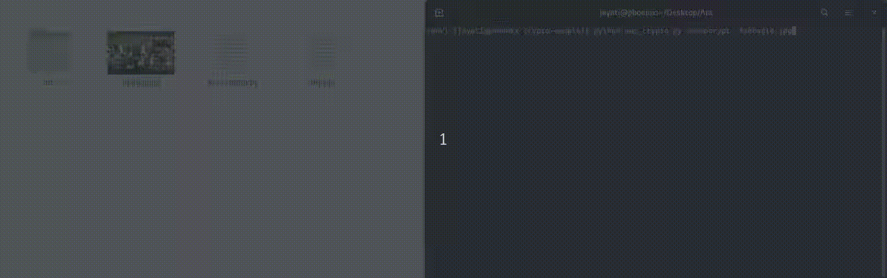

A sample program to demonstrate encryption of binary data using AES encryption and CFB mode of operation

```bash
For decrypting put the key and iv in the utils.py file
usage: aes_crypto.py [-h] [-m MODE] [-f FILE] [-k KEY] [-iv IV]

Basic Encryption and Decryption

optional arguments:
  -h, --help            show this help message and exit
  -m MODE, --mode MODE  encrypt/decrypt
  -f FILE, --file FILE  path to file which is to be encrypted/decrypted
  -k KEY, --key KEY     encryption key to be used for decrypting the file
  -iv IV                initialization vector

```




### Testing

Start a python3 virtual environment and install the dependencies
```bash
virtualenv --python=$(which python3) env
source env/bin/activate
pip install -r requirements.txt
```

#### Encrypt
```bash
python -m=encrypt -f=beagle.jpg
```

#### Decrypt
Put the key and the initialization vector in the file `utils.py`
```bash
python -m=decrypt -f=encrypted.ec
```

